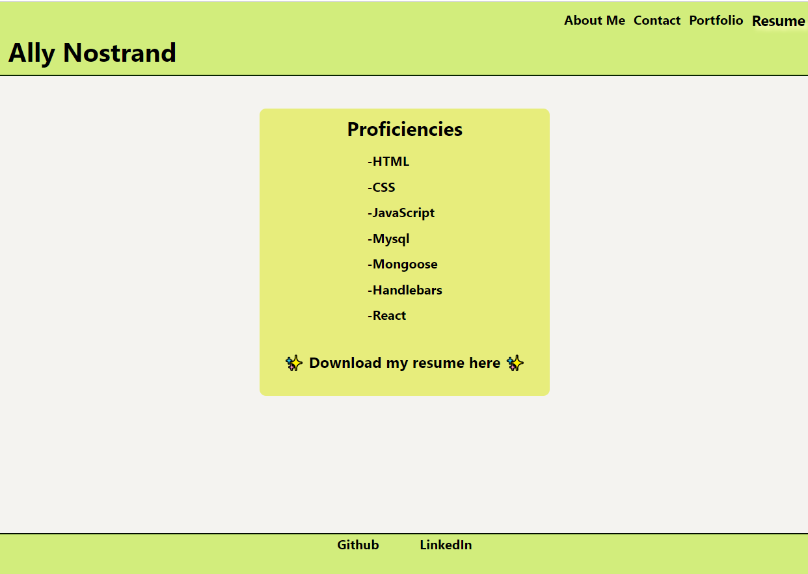
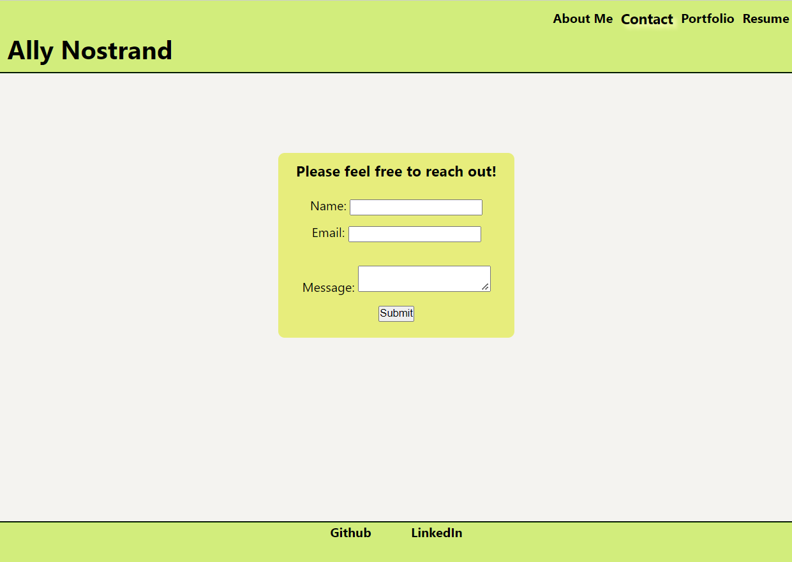

# react-portfolio

## Description 

Here is a link to the deployed application on Heroku
https://allysonnostrand.herokuapp.com/

The goal for this assignment was to create a portfolio using react. This portfolio features an about me page, along with a contact me, resume and portfolio section displaying some of my projects. 

[](https://opensource.org/licenses/MIT)

## Table of Contents
- [Installation](#installation)
- [Screenshots](#screenshots)
- [License](#license)
- [Questions](#questions)

## Installation

To run this application make sure to run the command ```npx create-react-app```. Npm packages to instal with ```npm i```...

- react-bootstrap
- react-router-dom

## Screenshots

Here are some screenshots of the deployed application






## License

This application is covered under MIT license. 

## Questions

https://github.com/allysonnostrand

You can reach me at allyson.nostrandd@gmail.com if you have any questions!
